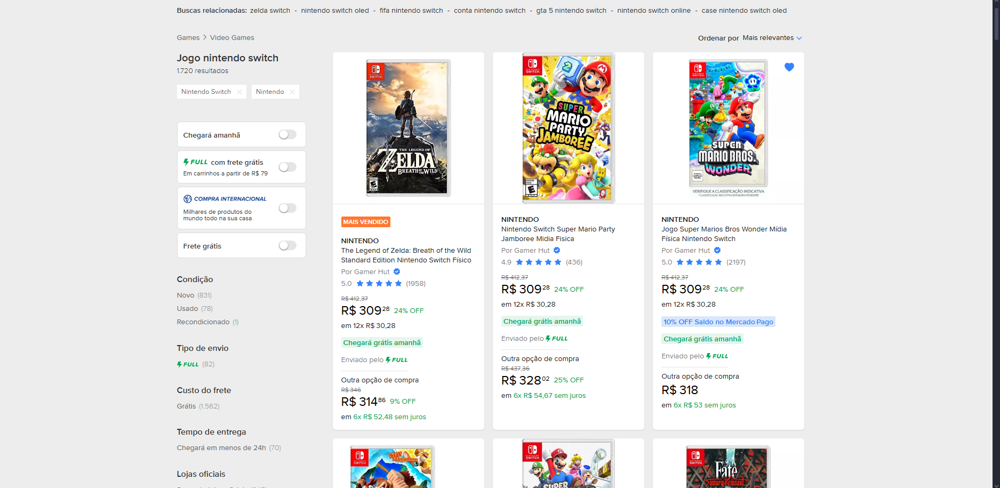
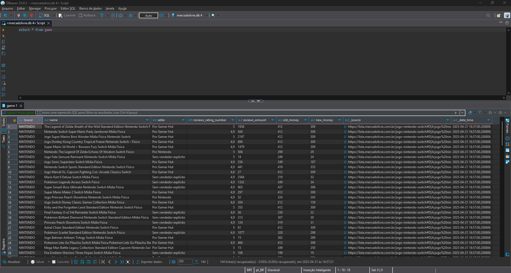
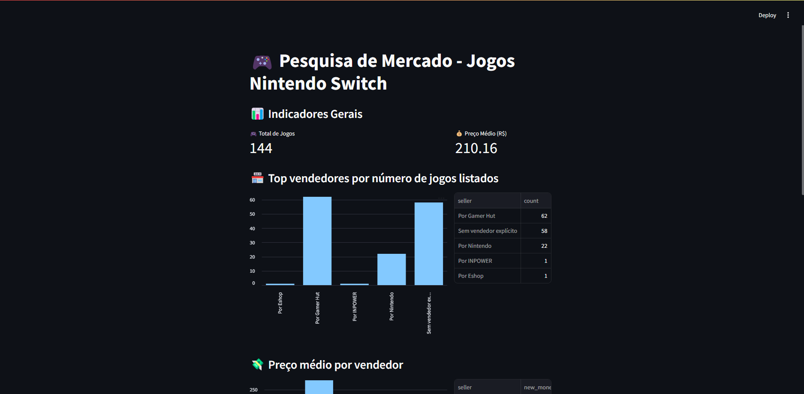

Web Scraping de Jogos de Nintendo Switch no Mercado Livre

Este projeto tem como objetivo coletar, analisar e visualizar os preços de jogos para Nintendo Switch no Mercado Livre, usando uma abordagem completa com *web scraping*, armazenamento de dados em banco de dados SQLite e visualização interativa com o Streamlit.

## 📜 Descrição

O projeto consiste em três partes principais:

1. **Coleta de Dados:** Utilizamos o Scrapy para fazer web scraping e coletar dados de jogos Nintendo Switch no Mercado Livre.
2. **Armazenamento de Dados:** Após a coleta, os dados são salvos em um banco de dados SQLite para consulta e análise.
3. **Análise e Visualização:** Usamos o Streamlit para criar um painel interativo que exibe os principais KPIs e gráficos sobre os preços dos jogos.

### 📊 Funcionalidades

- **Scraping de Jogos:** Coleta de informações sobre jogos de Nintendo Switch no Mercado Livre.
- **Armazenamento em Banco de Dados:** Os dados são armazenados em uma tabela SQLite, permitindo consultas e análises.
- **KPIs Interativos:** O painel no Streamlit exibe métricas como total de itens, preço médio, marcas mais populares, entre outros.
- **Gráficos e Visualizações:** Exibição de gráficos sobre os preços médios, avaliações e marcas mais frequentes.

## ⚙️ Tecnologias Utilizadas

- **Python 3.x**
- **Scrapy** - Para coletar dados de páginas do Mercado Livre.
- **SQLite** - Para armazenar os dados coletados.
- **Pandas** - Para manipulação e análise dos dados.
- **Streamlit** - Para a criação do painel interativo de visualização.

## 🚀 Como Usar

### 1. **Clone o Repositório**
   Clone o repositório para sua máquina local:
   ```bash
   git clone https://github.com/seu-usuario/nintendo-games-precos.git
   cd nintendo-games-precos

## 2. Instale as Dependências
Utilize um ambiente virtual (recomendado):

```
python -m venv .venv
.venv\Scripts\activate  # Para Windows
source .venv/bin/activate  # Para Linux/Mac
pip install -r requirements.txt
```

## 3. Execute o Scrapy para Coletar Dados
Para coletar os dados de jogos Nintendo Switch:

```
scrapy crawl games
```
Isso irá rodar o spider e coletar os dados, pode salvar em um arquivo JSON ou diretamente em um banco de dados SQLite, dependendo da configuração do projeto, com -o nome do arquivo.json/csv.

## 4. Inicie o Painel Interativo no Streamlit
Após a coleta dos dados, inicie o painel do Streamlit:

```
streamlit run app.py
```

O painel será aberto em seu navegador, onde você poderá visualizar os KPIs, gráficos e dados interativos.

### 📈 KPIs Exibidos
Total de Jogos: Número total de jogos encontrados.

Marcas Mais Populares: As marcas de jogos mais frequentes no Mercado Livre.

Preço Médio: Preço médio dos jogos listados.

Top vendedores por número de jogos listados: Quais vendedores tem mais anúncios.

Preço médio por vendedor: Qual o preço médio praticado por vendedor.

Satisfação média por vendedor: A satisfação média que o vendedor tem, colaborando para entender padrões.


## 🖼️ Exemplos do Projeto em ação
Aqui estão alguns exemplos de imagens que ilustram o funcionamento do painel e da consulta ao banco de dados:

Exemplo de página do Mercado Livre.
 

Teste da consulta SQL no DBeaver.
 

Exemplo de visualização no Streamlit.
 

## 📝 Considerações Finais
Este projeto proporciona uma maneira simples e eficaz de coletar e visualizar dados de preços de jogos Nintendo no Mercado Livre. Com o uso de web scraping, análise de dados e visualização interativa, ele permite acompanhar as tendências de preços e avaliar a competição entre as marcas.

Se você encontrar algum problema ou desejar contribuir com melhorias, fique à vontade para abrir um issue ou um pull request.